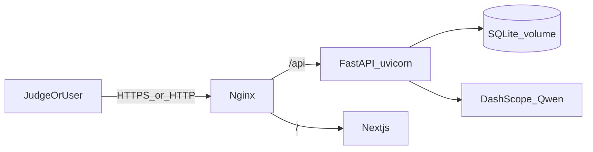

# End-to-End Deployment Plan (this chat = deploy only)

## Session role

| Chat | Owns |
|------|------|
| **This chat** | Live deploy, infra files, `docs/DEPLOYMENT.md`, deploy decisions |
| Tier 1 / Tier 2 chats | Product features — they must read `docs/DEPLOYMENT.md` before changing env/ports/CORS/DB paths |

## Locked target (now)

**One Alibaba Cloud ECS** running the full product:

| Piece | Choice now | Later (logged, not blocking live) |
|-------|------------|-----------------------------------|
| Compute | Alibaba **ECS** (2 vCPU / 4GB, Ubuntu 22.04) | Scale / ACK |
| Process | **Docker Compose**: `api` + `web` + `nginx` | systemd only if Docker blocked |
| DB | **SQLite** on named volume `./data` | RDS Postgres |
| LLM | Existing **DashScope** key on server | same |
| Frontend | Next.js `next start` behind nginx | OSS+CDN static (not now) |
| TLS | HTTP on public IP first; HTTPS via Caddy/Let’s Encrypt when domain exists | SLB + cert |
| CI | Manual `git pull` + `docker compose up -d --build` | GitHub Actions SSH deploy |
| Vector RAG | **Not in this deploy** | OpenSearch / pgvector Phase 3 |

**Why not Function Compute first:** SSE chat + long agent runs + SQLite volume are simpler and more reliable on ECS for a desk demo.

**Why not Vercel+Railway as primary:** Weaker Alibaba sponsor story; keep as emergency fallback only if ECS billing/region is blocked.

---

## What you must authenticate (browser — never paste passwords in chat)

Agent will **redirect you** to these consoles; you complete login/create resources; you return with **non-secret** outputs (IDs, public IP, region).

| Step | Where you go | What you return to this chat |
|------|----------------|------------------------------|
| 1 | [Alibaba Cloud International console](https://www.alibabacloud.com/) — sign in / create account | “Account ready” + preferred **region** (e.g. Singapore `ap-southeast-1`) |
| 2 | ECS → Create instance (Ubuntu 22.04, public IP, open **22/80/443**) | **Public IP**, instance ID, SSH user |
| 3 | SSH key or console password (you keep secret) | Confirm SSH works from your PC |
| 4 | DashScope key already in local `backend/.env` | Confirm same key will be set as **server env** (do not paste full key) |
| 5 | Optional later: domain DNS A record → ECS IP | Domain name for HTTPS |

**Agent never needs:** your Alibaba password, root password in chat, or raw DashScope key pasted into messages. Use env files / Secret Manager on the server.

If you have **no Alibaba account yet**, first todo is signup + billing/credits before ECS create.

---

## Repo work (implementation in this chat after plan approve)

Today there is **no** Docker/CI ([readiness scan](agent-transcripts)). Add:

| Artifact | Purpose |
|----------|---------|
| `backend/Dockerfile` | Python 3.11, uvicorn, persist `/app/data` |
| `frontend/Dockerfile` | multi-stage `next build` + `next start` |
| `docker-compose.yml` | `api`, `web`, `nginx` |
| `deploy/nginx.conf` | `/` → web:3000, `/api/` + `/health` → api:8000; SSE-friendly timeouts |
| `.env.production.example` | `DASHSCOPE_*`, `LLM_MODE=qwen`, `CORS_ORIGINS`, `NEXT_PUBLIC_API_URL`, `DATABASE_URL` |
| `docs/DEPLOYMENT.md` | **Source of truth for all chats**: live URL, env vars, how to redeploy, ports, SQLite volume, HITL restart caveat |
| `docs/DECISIONS.md` entry | Deploy decision log (ECS + Compose + SQLite now; RDS/HITL durable next) |
| Root `README.md` | Link to DEPLOYMENT.md + live URL when known |
| Optional: `deploy/ssh-up.sh` | Pull + compose rebuild one-liner |

### Nginx routing (locked)

- Browser uses **one origin** `http://PUBLIC_IP` (later `https://domain`).
- Frontend build: `NEXT_PUBLIC_API_URL=` empty or same-origin `/api` proxy — prefer **relative `/api/v1/...`** via nginx so CORS is trivial.
- Small frontend change if needed: [frontend/lib/api.ts](frontend/lib/api.ts) use `''` or `window.location.origin` when `NEXT_PUBLIC_API_URL` unset in prod; nginx rewrites `/api/` → `api:8000/api/`.

### Durable HITL (same deploy wave, small)

Live product must survive API container restart during supervisor wait:

- Replace in-memory `MemorySaver` with **SqliteSaver** (or Postgres later) under `backend/data/checkpoints.db` on the same volume.
- Document in DEPLOYMENT.md: volume must persist.

---

## Server runbook (you + agent)

1. You create ECS + open ports **22, 80** (443 when HTTPS).
2. Agent provides exact commands: install Docker, clone `https://github.com/Atif1299/alkhidmat-relief-copilot.git`, create `.env` from example, `docker compose up -d --build`.
3. Smoke: `GET http://IP/health` → `tier: B`; open `http://IP/chat`; Urdu happy path; PDF; HITL without killing container mid-flight.
4. Write final URL into `docs/DEPLOYMENT.md` and push to GitHub.

---

## Logging for other chats (required)

After each deploy milestone, update:

1. **[docs/DEPLOYMENT.md](docs/DEPLOYMENT.md)** — architecture, env, URL, redeploy steps, “when changing API paths / CORS / DB update this file”.
2. **[docs/DECISIONS.md](docs/DECISIONS.md)** — dated deploy decisions + “next: RDS / HTTPS domain / vector RAG”.
3. **[.cursor/rules/alkhidmat-core.mdc](.cursor/rules/alkhidmat-core.mdc)** — one line: live deploy via ECS Compose; see DEPLOYMENT.md.

So Tier 2/feature chats know: **don’t assume localhost-only**; respect production env and volume paths.

---

## Explicitly out of scope for this live cut

- Vector embeddings / OpenSearch / GCP
- Multi-tenant auth / JWT
- WhatsApp / real Alkhidmat API (Tier C)
- Kubernetes / ACK
- RDS (logged as **next** after URL is stable)

---

## Implementation todos (commit + push each)

1. Add Dockerfiles + compose + nginx + `.env.production.example`
2. Same-origin API client / nginx path alignment + SqliteSaver HITL checkpoints on volume
3. Write `docs/DEPLOYMENT.md` + DECISIONS + cursor rule pointer; push GitHub
4. **You:** authenticate Alibaba → create ECS → return public IP (agent waits / guides)
5. Remote bring-up commands + smoke checklist; record live URL in DEPLOYMENT.md; push

---

## Success criteria

- [ ] Public URL opens Aid Desk UI
- [ ] `/health` returns Tier B
- [ ] Live Qwen chat (Urdu) creates ticket + Knowledge citations
- [ ] HITL approve works after **API container restart** (durable checkpoint)
- [ ] PDF export works
- [ ] `docs/DEPLOYMENT.md` is the cross-chat contract
- [ ] Repo has reproducible `docker compose` path

## Next after live (logged, not this cut)

HTTPS + domain → RDS Postgres → GitHub Actions deploy → optional embeddings RAG on Alibaba.
