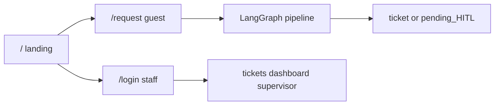

# Lab quality practices → docs → GCP redeploy

## Confirmed sequence

1. Quality pass (lab Stages 3–4 + light 6 spirit on **this** repo)
2. Local E2E green
3. **Then** GCP Cloud Run redeploy (last)

**Not in scope:** Spring Boot order demo, microservices split, BigDecimal money math.

**Default for CI:** GitHub Actions running `backend` pytest on push/PR to `main`.

---

## Docs discipline (yes — update as we go)

Every implementation todo that changes behavior or IA must update the matching source-of-truth docs in the same pass:

| Change | Update |
|--------|--------|
| Public `/` + `/request` + guest chat + staff `/login` | [`docs/ARCHITECTURE.md`](docs/ARCHITECTURE.md), [`docs/DEMO_SCRIPT.md`](docs/DEMO_SCRIPT.md) (already partly done; sync remaining login/root wording) |
| Validation / review / CI decisions | [`docs/DECISIONS.md`](docs/DECISIONS.md) — one dated entry: “Qoder lab practices applied to Aid Desk; product unchanged” |
| Deploy env/secrets checklist | [`docs/DEPLOYMENT.md`](docs/DEPLOYMENT.md) — JWT secret, CORS, guest chat note if needed |
| Optional one-pager for judges | Short “architecture story” section in ARCHITECTURE (graph + public vs staff) |

Do **not** treat [`.qoder/repowiki`](.qoder/repowiki) as source of truth.

---

## 1. Input validation (lab Stage 4 spirit)

Harden Pydantic at the API edge (not graph rewrite):

- [`backend/app/schemas.py`](backend/app/schemas.py) — `ChatRequest`: strip whitespace; reject blank-after-strip; keep `max_length=4000`; optional `case_id` as UUID string when present
- [`backend/app/api/auth.py`](backend/app/api/auth.py) — `LoginRequest`: email format + password length (already partly there); normalize email lower/strip
- [`backend/app/schemas.py`](backend/app/schemas.py) — `DecideRequest`: `note` max length; decision already constrained
- Frontend: disable empty submit already on `/request`; surface 422 messages clearly if needed

Add focused tests in [`backend/tests/`](backend/tests/) for empty message, oversized message, bad decision, unauthenticated supervisor still 401.

---

## 2. AI / human code review pass (auth · Integrity · chat)

Review and fix **real** issues only in:

- [`backend/app/deps/auth.py`](backend/app/deps/auth.py), [`backend/app/api/auth.py`](backend/app/api/auth.py)
- [`backend/app/api/chat.py`](backend/app/api/chat.py) (guest allowed; staff routes stay gated)
- Integrity / HITL path in agents + [`backend/app/api/supervisor.py`](backend/app/api/supervisor.py)

Target findings (typical lab themes mapped here):

- Secrets not logged; JWT secret required in prod
- Integrity never skipped on create
- Guest chat cannot call supervisor/cases
- Consistent 401/403/422

Write a short bullet list of findings + fixes into `docs/DECISIONS.md` (evidence for Q&A: “we ran AI-assisted review”).

---

## 3. Architecture story (lab Stage 3)

Update [`docs/ARCHITECTURE.md`](docs/ARCHITECTURE.md) so it matches polish:

- Graph: Intake → Triage → Knowledge → Integrity → HITL? → Matcher → Dispatch
- UI: public vs staff; staff home `/tickets`
- Fix stale “Open http://localhost:3000/login” as the only entry

---

## 4. Solid tests + light CI

- Keep / extend [`backend/tests/test_e2e.py`](backend/tests/test_e2e.py) (anonymous chat, auth gates, happy/duplicate/critical)
- Add validation unit/API tests as above
- Add [`.github/workflows/backend-tests.yml`](.github/workflows/backend-tests.yml): checkout → Python 3.11+ → `pip install -r backend/requirements.txt` → `pytest` with SQLite/test env from [`backend/tests/conftest.py`](backend/tests/conftest.py) (no live DashScope required)

---

## 5. Local green gate

Before GCP:

- `pytest` green
- Manual smoke: `/` → `/request` ticket · staff login → tickets · HITL approve · PDF

---

## 6. GCP redeploy (last)

Follow [`docs/DEPLOYMENT.md`](docs/DEPLOYMENT.md) Tier 3 promote checklist:

1. Cloud SQL `vector` extension
2. Secret Manager `jwt-secret` → `JWT_SECRET`
3. Rebuild/redeploy `relief-api` + `relief-web`
4. CORS includes live web URL
5. Confirm `/health` tier 3 + live login + public request against live API

---

## Success criteria

- Lab practices applied **on Aid Desk**, product identity unchanged
- Docs (ARCHITECTURE, DECISIONS, DEMO_SCRIPT, DEPLOYMENT) match shipped IA and decisions
- CI runs backend tests
- Local E2E green, then GCP live URLs updated/verified
