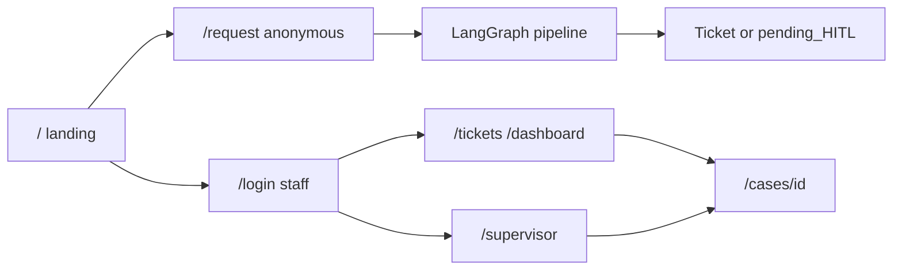

# Product Polish — Public Aid Desk + Staff Ops UX

## Session purpose (confirmed)

This chat is **reserved for polish**: information architecture, public vs staff logic, UI/UX that feels like **Alkhidmat Foundation Relief Copilot**, bug fixes from local use, demo script update, then **GCP redeploy only after local E2E is green**.

**Do not rebuild Tier 3** (JWT, Postgres, pgvector). Reuse it; change who hits which door.

**Citizen path locked:** **A — anonymous public `/request`** (no account, no password).

---

## Product model (market-ready)

| Audience          | How they enter                                                                                                     | Account                        |
| ----------------- | ------------------------------------------------------------------------------------------------------------------ | ------------------------------ |
| Citizen           | `/` → **Request aid** → `/request`                                                                                 | None (v1)                      |
| Desk / Supervisor | `/` → **Staff sign in** → `/login`                                                                                 | Seeded / admin-provisioned JWT |
| Judge demo        | Optional: Desk/Supervisor chips on login; Requester chip **removed from primary login** or demoted to “Demo tools” | Keep seed users in DB          |

**Winning line (UI + demo):** Citizen submits in Urdu → desk sees verified ticket → supervisor only when needed → everyone knows next step (ticket ID / waiting for approval).

---

## Skill stack (use these; don’t invent more process)

| Skill                                                                                                                                                                     | When                                                                            |
| ------------------------------------------------------------------------------------------------------------------------------------------------------------------------- | ------------------------------------------------------------------------------- |
| `[.agents/skills/frontend-design](.agents/skills/frontend-design/SKILL.md)`                                                                                               | Landing + login + request visual identity (palette, type, one signature moment) |
| `[.agents/skills/web-design-guidelines](.agents/skills/web-design-guidelines/SKILL.md)`                                                                                   | Pass over public + staff surfaces (a11y, focus, reduced motion)                 |
| `[.agents/skills/vercel-react-best-practices](.agents/skills/vercel-react-best-practices/SKILL.md)`                                                                       | Dynamic import heavy panels; avoid chrome waterfalls                            |
| `[.agents/skills/verification-before-completion](.agents/skills/verification-before-completion/SKILL.md)`                                                                 | Browser E2E before claiming done                                                |
| `[.agents/skills/systematic-debugging](.agents/skills/systematic-debugging/SKILL.md)`                                                                                     | Local polish bugs                                                               |
| `[.cursor/skills/alkhidmat-build](.cursor/skills/alkhidmat-build/SKILL.md)`                                                                                               | Stay inside product graph + tier rules                                          |
| **Install** `[ui-ux-pro-max](https://github.com/nextlevelbuilder/ui-ux-pro-max-skill)` via `npx skills add … --skill ui-ux-pro-max` ([skills.sh](https://www.skills.sh/)) | Layout density, staff-desk patterns, component polish                           |

**Design posture (Alkhidmat + NGO SaaS, not AI-slop):**

- Subject: **relief operations desk** — trust, clarity, urgency without panic.
- Palette: keep green trust (`#0d6b4c`) + warm secondary (`#c45c26`); refine tokens in `[frontend/app/globals.css](frontend/app/globals.css)`; avoid cream-serif / acid-dark generic templates.
- **Signature (one bold beat):** live **agent pipeline strip** on `/request` (Intake→…→ticket) — that is the product, not a decorative hero gradient.
- Motion: short page-load + step reveal on pipeline; respect `prefers-reduced-motion`. No scattered animation noise.
- Copy: citizen language (“Request aid”, “What happens next”); strip “Tier 3 JWT”, “for judges”, “Multi-Agent Ops · Tier 3”.

---

## Target information architecture

| Route                                                  | Auth                       | Chrome                                                     | Purpose                                                                                                                                   |
| ------------------------------------------------------ | -------------------------- | ---------------------------------------------------------- | ----------------------------------------------------------------------------------------------------------------------------------------- |
| `/`                                                    | Public                     | Minimal public header (logo + Request aid + Staff sign in) | Landing hero + dual CTA                                                                                                                   |
| `/request`                                             | **Public** (anonymous API) | Public chrome (no ops nav)                                 | Urdu/EN intake + agent trace + clear next step                                                                                            |
| `/login`                                               | Public form                | Minimal; title **Staff sign in**                           | Desk + Supervisor only (demo chips)                                                                                                       |
| `/chat`                                                | Staff JWT                  | Ops topbar                                                 | Optional: redirect desk→tickets, or keep as “Test intake” for staff — prefer **staff default home = `/tickets`**, `/request` for citizens |
| `/tickets`, `/dashboard`, `/supervisor`, `/cases/[id]` | Desk / Supervisor JWT      | Ops topbar                                                 | Unchanged capabilities; visual + copy polish                                                                                              |

**Files that must change for IA:**

- `[frontend/app/page.tsx](frontend/app/page.tsx)` — stop `redirect("/login")`; build landing
- New `frontend/app/request/page.tsx` — public intake (fork from `[frontend/app/chat/page.tsx](frontend/app/chat/page.tsx)`)
- `[frontend/components/AppChrome.tsx](frontend/components/AppChrome.tsx)` — allow `/`, `/request`, `/login` without token; hide ops nav on public routes
- `[frontend/lib/roles.ts](frontend/lib/roles.ts)` — public path allowlist; desk/supervisor home → `/tickets` (not `/chat`); drop requester as primary product role in nav (optional keep seed for API tests)
- `[frontend/app/login/page.tsx](frontend/app/login/page.tsx)` — Staff sign in; Desk + Supervisor chips only
- Backend: `[backend/app/api/chat.py](backend/app/api/chat.py)` + `[backend/app/deps/auth.py](backend/app/deps/auth.py)` — allow **optional auth** on `POST /chat` and `/chat/sync` (anonymous OK); keep JWT required on tickets/metrics/supervisor

---

## Page-by-page polish brief

### Public landing `/`

- Hero thesis: aid request (Urdu/EN) → verified ticket / supervisor gate.
- Two CTAs only: **Request aid** | **Staff sign in**.
- Short “How it works” (3 steps) + trust line (Alkhidmat-style desk, HITL for critical).
- No login wall, no role chips.

### Public `/request`

- Sample Urdu + English chips; one clear submit.
- After submit: **ticket ID or “Waiting for supervisor”** above the fold (winning signal).
- Agent trace as supporting evidence; no links to `/cases` or `/supervisor` for guests (show status text instead).
- Optional phone field later — **out of scope** for this polish pass.

### Staff `/login`

- “Staff sign in” + Desk / Supervisor demo chips.
- Link back to landing / Request aid.
- Remove Tier 3 / JWT / seeded password prominence (password can stay in small demo hint for judges).

### Staff desk (tickets / dashboard / supervisor / case)

- Dense, calm ops UI: clearer status badges, empty states with next action, supervisor note UX, link case ↔ HITL correctly by role.
- Topbar: “Alkhidmat Relief Copilot · Aid Desk” (no Tier 3).
- Fix known logic bugs from audit: requester/case dead-ends go away once citizen is public; desk must not see Approve they can’t run; nav active state for `/cases/[id]`.

---

## Implementation order (execute after you approve this plan)

1. **Install** `ui-ux-pro-max` into `.agents` (or project skills) if missing.
2. **Design tokens + chrome split** — public vs ops shells in AppChrome + globals.
3. **Backend guest chat** — optional JWT on chat endpoints; tests for anonymous OK + staff routes still gated.
4. **Landing + `/request` + login copy/IA**.
5. **Staff surfaces polish** (tickets/dashboard/supervisor/case) — density, badges, empty states, cross-links.
6. **Local bug list** from your testing (fix as found; systematic-debugging).
7. **Demo script** update: citizen no-login → desk → HITL → PDF.
8. **Browser verify** full paths (desktop + narrow mobile for landing/request).
9. **GCP redeploy** — separate final todo; only after local green (JWT secret, CORS, env already documented in `docs/DEPLOYMENT.md`).

---

## Out of scope (this polish session)

- WhatsApp / Tier C, self-signup, phone OTP, admin user-mgmt UI, 10+ agents marketplace, full redesign of LangGraph agents, Alibaba ECS.

---

## Success criteria

- Unauthenticated user: landing → request → sees ticket ID or HITL wait **without login**.
- Staff: login → tickets/HITL/PDF as today with JWT.
- No “Tier 3 JWT” / judge-only chrome copy on primary surfaces.
- Visual identity reads **NGO relief desk**, not internal hackathon tool.
- Local E2E green .

