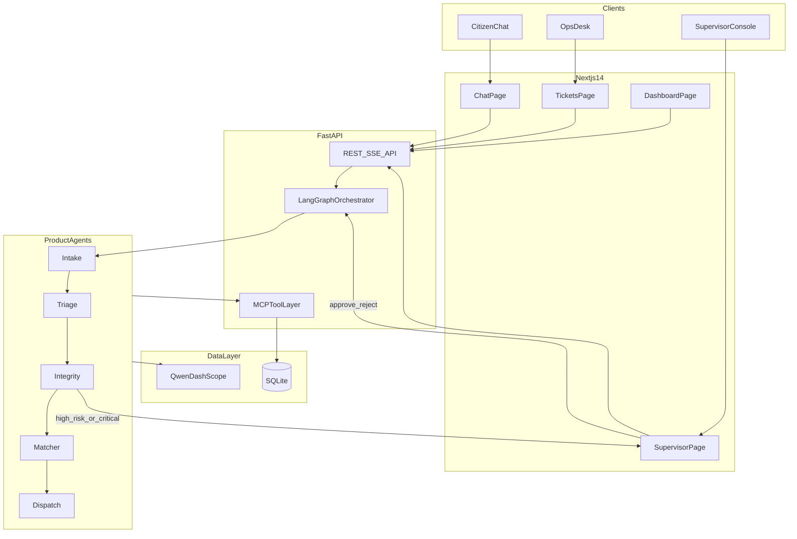
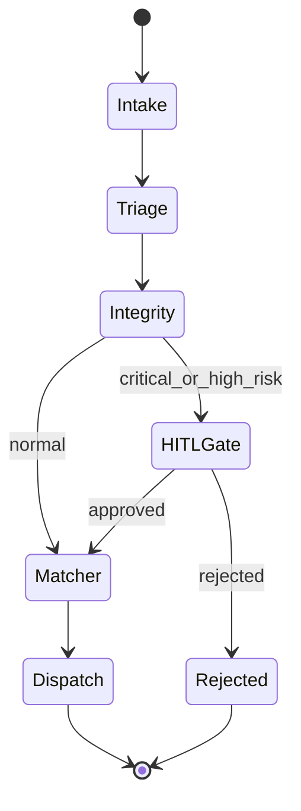

# Tier A Architecture — Alkhidmat Relief Copilot

## Orchestrator decision: LangGraph over Hermes

| Dimension | Hermes Agent (Nous) | LangGraph | Verdict for this product |
|-----------|---------------------|-----------|--------------------------|
| Primary use case | 24/7 autonomous agent + messaging gateway (Telegram/WhatsApp) | Governed multi-step workflows with explicit control flow | **LangGraph** — we need a **desk workflow**, not an autonomous bot |
| HITL / supervisor gate | Autonomous by design; human is optional | First-class **interrupt/checkpoint** before dispatch | **LangGraph** — Supervisor approve/reject is core |
| Custom SaaS UI | Terminal + messaging channels; custom ops UI is a fight | Backend graph streams events to any UI (SSE/WebSocket) | **LangGraph** — Chat + Supervisor + Dashboard |
| Deterministic pipeline | Kanban swarm auto-decomposes open tasks | Fixed graph: Intake → Triage → Integrity → Matcher → Dispatch | **LangGraph** — NGO SOP must never skip Integrity |
| Alibaba / Qoder story | Provider-agnostic; not ACS-native | FastAPI + DashScope SDK fits hackathon stack | **LangGraph** |
| Hackathon demo risk | Newer, gateway-centric, WSL2 constraints on Windows | Battle-tested, huge docs, fits 6-day build | **LangGraph** |
| Market buzz | High (2026 peak) | Industry standard for agentic products | Use **LangGraph for orchestration**; borrow Hermes/Qoder patterns for **MCP tools + Skills** narrative |

**Architect recommendation:** Use **LangGraph** as the orchestration engine. Position in pitch as: *"Governed agentic workflow (LangGraph) + tool contracts (MCP-style) — the same composable agent patterns taught in Qoder training."* Do not rebuild the product inside Hermes gateway.

---

## Product identity (locked)

From [docs/PRODUCT_DEFINITION.md](docs/PRODUCT_DEFINITION.md):

- **What:** NGO Aid Desk SaaS module (demo = Alkhidmat Lahore workspace)
- **Promise:** Free-text Urdu/English request → verified ticket + next action in under 60 seconds
- **Winning signal:** Desk operator and requester **know what happens next**

---

## System context



---

## Tier A scope (what we ship)

| # | Capability | Acceptance criteria |
|---|------------|---------------------|
| A1 | Citizen chat (Urdu + EN) | Submit request, see streaming agent trace |
| A2 | 6-agent LangGraph pipeline | Intake → Triage → Integrity → Matcher → Dispatch; Integrity never skipped |
| A3 | HITL supervisor | Critical/high-risk cases pause; approve/reject resumes graph |
| A4 | Duplicate detection | Same phone within 24h flagged; no duplicate dispatch |
| A5 | Resource matching | Lahore seed inventory matched by category |
| A6 | Ticket lifecycle | Status: `pending_hitl` → `open` → `dispatched` → `closed` |
| A7 | Ops dashboard | Cases today, avg time-to-ticket, % escalated |
| A8 | Audit log | Agent steps + supervisor decisions timestamped |
| A9 | Qwen integration | Real DashScope calls with env fallback for offline dev |
| A10 | Demo paths | 3 scripted scenarios pass E2E |

---

## Repository and monorepo layout

**GitHub repo name:** `alkhidmat-relief-copilot`

```
alkhidmat-relief-copilot/
├── README.md
├── .env.example
├── docker-compose.yml          # optional: api + db
├── backend/
│   ├── pyproject.toml
│   ├── app/
│   │   ├── main.py               # FastAPI entry
│   │   ├── config.py
│   │   ├── db/
│   │   │   ├── models.py         # SQLAlchemy models
│   │   │   ├── session.py
│   │   │   └── seed.py           # Lahore seed data
│   │   ├── schemas/              # Pydantic request/response
│   │   ├── api/
│   │   │   ├── cases.py
│   │   │   ├── chat.py           # POST /chat, SSE stream
│   │   │   ├── supervisor.py     # HITL approve/reject
│   │   │   └── metrics.py
│   │   ├── agents/
│   │   │   ├── state.py          # LangGraph CaseState TypedDict
│   │   │   ├── graph.py          # Graph definition + compile
│   │   │   ├── nodes/            # intake, triage, integrity, matcher, dispatch
│   │   │   └── prompts/          # en + ur system prompts
│   │   ├── tools/                # MCP-style tool functions
│   │   │   ├── cases.py
│   │   │   ├── resources.py
│   │   │   └── notify.py
│   │   └── services/
│   │       ├── llm.py            # DashScope Qwen wrapper
│   │       └── audit.py
│   └── tests/
│       ├── test_happy_path.py
│       ├── test_duplicate.py
│       └── test_escalation.py
├── frontend/
│   ├── package.json
│   ├── app/
│   │   ├── layout.tsx
│   │   ├── page.tsx              # redirect to /chat
│   │   ├── chat/page.tsx
│   │   ├── tickets/page.tsx
│   │   ├── supervisor/page.tsx
│   │   └── dashboard/page.tsx
│   ├── components/
│   │   ├── AgentTrace.tsx        # visible pipeline — key judge moment
│   │   ├── ChatPanel.tsx
│   │   ├── TicketCard.tsx
│   │   └── MetricsCards.tsx
│   └── lib/api.ts
└── docs/
    ├── ARCHITECTURE.md           # this plan as living doc
    └── DEMO_SCRIPT.md
```

Existing planning docs ([AGENTS.md](AGENTS.md), [docs/PRODUCT_DEFINITION.md](docs/PRODUCT_DEFINITION.md)) move into repo root `docs/` on first commit.

---

## LangGraph design (core)

### State schema (`CaseState`)

```python
class CaseState(TypedDict):
    case_id: str | None
    raw_message: str
    language: str                    # "ur" | "en"
    extracted: dict                  # need, location, urgency, contact
    category: str                    # Food|Medical|Shelter|Blood|Education|Other
    priority: str                    # low|medium|high|critical
    integrity: dict                  # risk_score, duplicate_flag, reasons
    matched_resources: list[dict]
    ticket_id: str | None
    status: str
    agent_trace: list[dict]          # [{agent, action, ts, detail}]
    requires_hitl: bool
    hitl_decision: str | None        # approved|rejected
    error: str | None
```

### Graph flow



**HITL implementation:** LangGraph `interrupt_before=["dispatch"]` when `requires_hitl=True`. Supervisor API calls `graph.update_state()` + `graph.invoke()` resume with `hitl_decision`.

**Integrity rule (non-negotiable):** Edge from Intake never goes directly to Matcher — always through Integrity node.

### Agent responsibilities

| Node | LLM role | Tools |
|------|----------|-------|
| Intake | Extract structured fields from Urdu/EN free text | — |
| Triage | Classify category + priority | — |
| Integrity | Duplicate/fraud heuristics | `search_similar_cases` |
| Matcher | Pick best resource | `list_resources` |
| Dispatch | Create ticket + assign | `create_case`, `assign_volunteer`, `send_status_message` |

Each node appends to `agent_trace` for UI visibility.

---

## Data model (SQLite / SQLAlchemy)

**Tables:**

- `cases` — id, raw_message, language, category, priority, status, risk_score, duplicate_flag, matched_resource_id, volunteer_id, created_at, resolved_at, time_to_ticket_ms
- `case_events` — audit log (case_id, actor, event_type, payload_json, created_at)
- `resources` — id, category, name, city, area, stock/capacity, contact
- `volunteers` — id, name, phone, skills[], area
- `hitl_queue` — case_id, reason, status (pending/approved/rejected), supervisor_note, decided_at

**Seed data (Lahore):** 20 resources, 10 volunteers, 5 pre-seeded cases for duplicate demo (same phone `03001234567`).

---

## API contract (FastAPI)

| Method | Path | Purpose |
|--------|------|---------|
| POST | `/api/v1/chat` | Submit message; returns `case_id`, streams agent trace via SSE |
| GET | `/api/v1/cases` | List tickets (filter by status) |
| GET | `/api/v1/cases/{id}` | Case detail + full agent trace |
| GET | `/api/v1/supervisor/queue` | Pending HITL cases |
| POST | `/api/v1/supervisor/{case_id}/decide` | `{decision: approve\|reject, note}` |
| GET | `/api/v1/metrics` | `{cases_today, avg_time_to_ticket_ms, escalation_pct}` |
| GET | `/health` | Health check |

**SSE event types:** `agent_step`, `hitl_required`, `ticket_created`, `error`, `done`

---

## Frontend (Next.js 14 App Router)

| Route | Role | Key UI |
|-------|------|--------|
| `/chat` | Citizen / demo | Message input, Urdu sample chips, **AgentTrace** sidebar |
| `/tickets` | Ops desk | Ticket table, status badges, trace expand |
| `/supervisor` | HITL | Pending queue, approve/reject + note |
| `/dashboard` | Judges | Metric cards + simple chart |

**Design principle:** Agent trace visible on every run — this is the "agentic product" proof judges expect.

---

## Alibaba Cloud integration

| Service | Usage in Tier A |
|---------|-----------------|
| **DashScope / Qwen** | All agent LLM calls via `DASHSCOPE_API_KEY` |
| **Qoder** | Dev environment; port repo when access arrives |
| **OSS** | Stub endpoint for doc upload (optional Tier A stretch) |
| **ECS / Function Compute** | Deploy target for README architecture slide |

**Offline dev fallback:** If no API key, use deterministic rule-based extraction for demo (flag in env `LLM_MODE=mock|qwen`).

---

## Demo scenarios (must pass)

1. **Urdu food (happy path):** `"Flood ke baad khane ki zaroorat hai, Township Lahore, family of 5"` → Food ticket, resource matched
2. **Duplicate:** Same phone again → `duplicate_flag=true`, status blocked or flagged
3. **Critical medical:** `"Chest pain, need ambulance, Johar Town"` → HITL queue → supervisor approves → ticket created

---

## Git strategy (green profile)

**Rule:** One commit + push to `origin/main` after **each** implementation todo below.

Commit message format:
```
feat(scope): short description

- bullet of what shipped
```

Example: `feat(backend): add LangGraph case pipeline with Integrity gate`

**Branch:** `main` (or `develop` if you prefer PRs — default `main` for speed).

**Remote setup (first todo):**
```bash
git init
git remote add origin git@github.com:<your-username>/alkhidmat-relief-copilot.git
```

---

## Implementation todos (each ends with commit + push)

### Phase 0 — Repo bootstrap
- Initialize monorepo structure, README, `.env.example`, move existing `docs/` into repo
- **Push:** `chore: initialize alkhidmat-relief-copilot monorepo`

### Phase 1 — Backend skeleton
- FastAPI app, SQLAlchemy models, Alembic or create_all, seed script
- **Push:** `feat(backend): add FastAPI skeleton, DB models, Lahore seed data`

### Phase 2 — Tools layer
- Implement `search_similar_cases`, `list_resources`, `create_case`, `assign_volunteer`, `send_status_message`, audit logger
- **Push:** `feat(backend): add MCP-style relief desk tools`

### Phase 3 — LangGraph core
- `CaseState`, 5 nodes, graph compile, mock LLM E2E English path
- **Push:** `feat(agents): add LangGraph intake-to-dispatch pipeline`

### Phase 4 — HITL gate
- Interrupt/resume, supervisor queue API, integrity escalation rules
- **Push:** `feat(agents): add HITL supervisor gate and queue API`

### Phase 5 — Qwen integration
- DashScope wrapper, Urdu + English prompts, agent_trace enrichment
- **Push:** `feat(llm): integrate DashScope Qwen with bilingual prompts`

### Phase 6 — Chat API + SSE
- POST `/chat` with streaming agent steps
- **Push:** `feat(api): add chat endpoint with SSE agent trace stream`

### Phase 7 — Frontend shell
- Next.js 14 layout, nav, API client, env config
- **Push:** `feat(frontend): scaffold Next.js 14 app shell`

### Phase 8 — Chat + AgentTrace UI
- Chat page with streaming trace sidebar, Urdu demo chips
- **Push:** `feat(frontend): add chat page with live agent trace`

### Phase 9 — Supervisor + Tickets UI
- HITL approve/reject, ticket list with status
- **Push:** `feat(frontend): add supervisor and tickets views`

### Phase 10 — Dashboard + metrics API
- Metrics endpoint + dashboard cards
- **Push:** `feat(dashboard): add ops metrics and dashboard page`

### Phase 11 — Tests + demo script
- 3 E2E pytest scenarios, `docs/DEMO_SCRIPT.md`
- **Push:** `test: add happy path, duplicate, and escalation E2E tests`

### Phase 12 — Polish + architecture doc
- README deploy notes, `docs/ARCHITECTURE.md` diagram, `.env.example` complete
- **Push:** `docs: add architecture diagram and deployment guide`

---

## What we explicitly do NOT build in Tier A

- Hermes gateway / kanban swarm
- Full Agentic RAG (Tier B)
- WhatsApp production integration
- Multi-tenant billing
- Real Alkhidmat API

---

## Judge-facing architecture slide (one-liner)

**Stack:** Next.js Aid Desk → FastAPI → LangGraph (6 agents) → Qwen on DashScope → SQLite → HITL Supervisor

**Differentiator:** Governed agentic workflow with visible trace, duplicate protection, and human approval for critical relief cases — built for Alkhidmat-scale operations.
