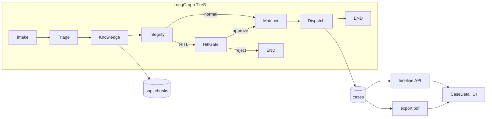

# Tier B (Tier 2) Implementation Plan

## Context (locked)

Tier A is complete and running: LangGraph `Intake → Triage → Integrity → HITL? → Matcher → Dispatch`, FastAPI + SSE, Next.js `/chat|/tickets|/supervisor|/dashboard`, E2E tests for happy/duplicate/HITL.

Tier B scope from [docs/PRODUCT_DEFINITION.md](docs/PRODUCT_DEFINITION.md) and [.cursor/skills/alkhidmat-build/tier-reference.md](.cursor/skills/alkhidmat-build/tier-reference.md):

| ID | Feature | Judge value |
|----|---------|-------------|
| B8 | Light RAG / SOP Knowledge agent (UI-visible) | Agentic + domain knowledge; Qoder Skills/MCP narrative |
| B9 | Role views: Requester / Desk / Supervisor | SaaS “industry usable” story |
| B10 | Case status timeline | Ops product feel; impact clarity |
| B11 | Richer Lahore district seed | Believable Alkhidmat demo |
| B12 | PDF case export | Ops/industrial deliverable |

**Do not build Tier C** (WhatsApp prod, real Alkhidmat API, billing, mobile, 10+ agents).

**Repo:** https://github.com/Atif1299/alkhidmat-relief-copilot.git — commit + push after each todo.

---

## Locked design decisions (no open options)

### B8 — Light RAG (not a vector mega-stack)

- Corpus: markdown SOPs under `backend/app/knowledge/sops/` (Food, Medical, Shelter, Blood, Education, Integrity/HITL, Urdu FAQ snippets).
- Index at startup into SQLite table `sop_chunks` (id, category, title, body, keywords) — rebuildable from files.
- Retrieval: keyword + category filter (`search_sops(category, query, limit=3)`) — no external vector DB.
- New LangGraph node **`knowledge`** inserted **after Triage, before Integrity**:

```
Intake → Triage → Knowledge → Integrity → HITL? → Matcher → Dispatch
```

- State fields: `sop_hits: list[{title, category, excerpt, score}]`; append Knowledge step to `agent_trace`; write `case_events` type `sop_retrieved`.
- Matcher may read `sop_hints` lightly (e.g. prefer blood-bank match for Blood) without changing Integrity rules.
- UI: citations panel on chat result + case detail (“Sources / SOPs used”).

### B9 — Roles without real auth

- Demo **role switcher** in topbar: `requester | desk | supervisor` stored in `localStorage` (`aiddesk_role`).
- Route gating (client):
  - Requester → `/chat` only (nav hides Tickets/Supervisor/Dashboard)
  - Desk → `/tickets`, `/cases/[id]`, `/dashboard` (no Supervisor decide)
  - Supervisor → `/supervisor` + tickets/detail
- No JWT/OAuth (Tier C-adjacent). Header `X-Demo-Role` optional on API for future; backend stays open for hackathon demo.

### B10 — Product timeline (not raw audit dump)

- New endpoint `GET /api/v1/cases/{id}/timeline` returns ordered stages:
  `requested → triaged → knowledge → integrity_checked → pending_hitl? → matched → dispatched|rejected|closed`
- Derive from existing `case_events` + case status; backfill missing stages from `agent_trace` when needed.
- New page `frontend/app/cases/[id]/page.tsx`: status ladder + events + AgentTrace + SOP citations + Export PDF.

### B11 — Seed expansion

- Expand [backend/app/db/seed.py](backend/app/db/seed.py): ~25–30 resources across Lahore districts (Township, Johar Town, Gulberg, Model Town, Allama Iqbal Town, Thokar, Raiwind, etc.), ~15 volunteers, 4–6 historical cases with events (including seed duplicate phone `03001234567`).
- Seed SOP files + `sop_chunks` on startup.
- Keep duplicate/critical demo phones intact.

### B12 — PDF export

- Dependency: `reportlab`
- `GET /api/v1/cases/{id}/export.pdf` — ticket summary, category/priority, integrity, matched resource, SOP citations, timeline, supervisor note.
- Button on case detail + tickets row action.

---

## Architecture extension



**Extend, do not rewrite:** keep Integrity non-skippable; HITL resume path unchanged; add Knowledge only on the create path before Integrity.

---

## Implementation order (each todo = commit + push)

### 1. Docs + Cursor sync for Tier B
- Update [docs/ARCHITECTURE.md](docs/ARCHITECTURE.md) to Tier B graph + Knowledge/SOP/PDF/roles.
- Update [.cursor/skills/alkhidmat-build/SKILL.md](.cursor/skills/alkhidmat-build/SKILL.md) and [tier-reference.md](.cursor/skills/alkhidmat-build/tier-reference.md) with Tier B acceptance criteria and “Tier A green → Tier B only”.
- Log decision in [docs/DECISIONS.md](docs/DECISIONS.md).
- Commit: `docs: lock Tier B architecture and Cursor build guidance`

### 2. B11 — Richer Lahore seed + SOP corpus files
- SOP markdown files + seed resources/volunteers/cases expansion.
- Commit: `feat(seed): expand Lahore inventory and SOP corpus`

### 3. B8 backend — SOP store, tool, Knowledge node
- Model `SopChunk`; `search_sops` tool; `knowledge_node`; wire graph edge Triage→Knowledge→Integrity; extend `CaseState`.
- SSE: Knowledge appears as `agent_step`; include `sop_hits` on final payload.
- Commit: `feat(agents): add Knowledge RAG node with SOP retrieval`

### 4. B10 backend — timeline API
- `GET /api/v1/cases/{id}/timeline` + enrich case detail with `sop_hits` if stored (JSON column on cases or from events payload).
- Commit: `feat(api): add case timeline endpoint`

### 5. B12 backend — PDF export
- Reportlab renderer + export route.
- Commit: `feat(api): add PDF case export`

### 6. B9 + B10 + B8 frontend
- Role switcher + nav gating.
- `/cases/[id]` with timeline ladder, citations, export button.
- Chat: show SOP citations after run.
- Tickets: link to case detail.
- Commit: `feat(frontend): role views, case timeline, SOP citations, PDF export`

### 7. Tests + demo polish
- E2E: Knowledge step present; timeline shape; PDF 200; role UI smoke (optional).
- Update [docs/DEMO_SCRIPT.md](docs/DEMO_SCRIPT.md) with Tier B beat: “SOP retrieved → show citation → export PDF”.
- Commit: `test: Tier B knowledge, timeline, and PDF coverage`
- Bump health `tier: "B"` when Tier B APIs live.

### 8. Verification before claiming done
- Run backend tests; smoke chat (Urdu) + timeline + PDF locally.
- Follow [.agents/skills/verification-before-completion/SKILL.md](.agents/skills/verification-before-completion/SKILL.md).

---

## Key files to touch

| Area | Files |
|------|--------|
| Graph | [backend/app/agents/graph.py](backend/app/agents/graph.py), [nodes.py](backend/app/agents/nodes.py), [state.py](backend/app/agents/state.py) |
| Knowledge | new `backend/app/knowledge/`, `backend/app/tools/sops.py`, model in [models.py](backend/app/db/models.py) |
| Seed | [backend/app/db/seed.py](backend/app/db/seed.py) |
| API | [cases.py](backend/app/api/cases.py) (+ timeline, export), [chat.py](backend/app/api/chat.py) payload |
| UI | [layout.tsx](frontend/app/layout.tsx), new `cases/[id]/page.tsx`, [chat/page.tsx](frontend/app/chat/page.tsx), [tickets/page.tsx](frontend/app/tickets/page.tsx), [api.ts](frontend/lib/api.ts), [globals.css](frontend/app/globals.css) |
| Tests | [backend/tests/test_e2e.py](backend/tests/test_e2e.py) |

---

## Acceptance criteria (Tier B done)

- [ ] Agent trace shows **Knowledge** step with SOP titles on happy-path chat
- [ ] Chat/case detail shows **citations** (excerpt visible to judges)
- [ ] Role switcher changes nav: requester cannot open Supervisor
- [ ] Case detail timeline shows ordered stages including HITL when relevant
- [ ] Seed feels like multi-district Lahore desk (≥25 resources)
- [ ] PDF downloads for a dispatched case
- [ ] Existing Tier A tests still pass (happy / duplicate / HITL approve)
- [ ] Each todo pushed to `origin/main`

---

## Demo beat for judges (30s add-on)

After Tier A live request: open case detail → show timeline + SOP citations → Export PDF → flip role switcher (Requester vs Supervisor). Narrative: *“Governed agents + Alkhidmat SOPs + ops-ready export — not a chatbot.”*
