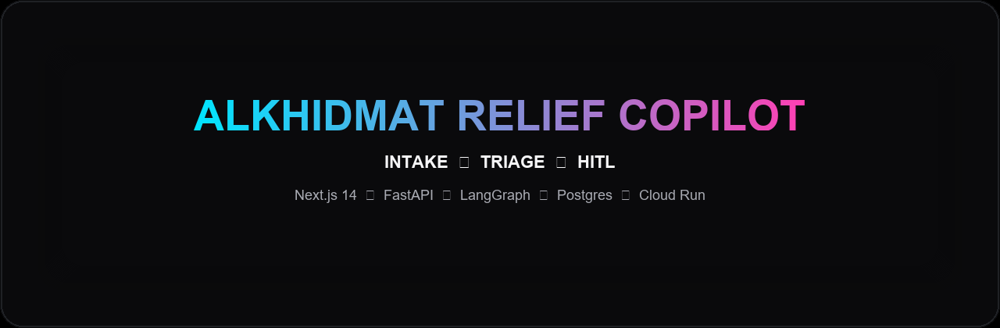

<p align="center">
  
</p>

<p align="center">
  
  
  
  
  
</p>

<p align="center">
  
  
</p>

<p align="center">
  
  
</p>

<p align="center">
  A multi-agent AI desk that turns an aid request (Urdu/English) into a verified, routed relief ticket — with human approval for high-risk cases.
</p>

<p align="center">
  <a href="#quick-start">Quick start</a> ·
  <a href="#capabilities">Capabilities</a> ·
  <a href="#project-layout">Project layout</a> ·
  <a href="#deploy">Deploy</a> ·
  <a href="#docs">Docs</a>
</p>

---

## What is Alkhidmat Relief Copilot?

**Alkhidmat Relief Copilot** is an **NGO aid desk SaaS** (not a chatbot) built for **Alibaba Cloud AI Hackathon Pakistan 2026**, powered by **Qwen via DashScope**. Citizens submit needs on a public request page; a **LangGraph** pipeline runs **Intake → Triage → Knowledge → Integrity → Matcher → Dispatch**, with a **HITL supervisor gate** for critical or high-risk cases. Staff sign in to tickets, agent traces, metrics, and PDF export — on **FastAPI + Next.js 14 + Postgres/pgvector**, live on **Google Cloud Run**.

## Capabilities

- **Public request path** — `/` sitrep landing → `/request` guest intake → `/status` with AKD number + phone (no citizen account)
- **Staff ops** — JWT roles (desk / supervisor); home `/tickets`
- **Agent trace** — live pipeline + sitrep replay on the landing (replay is local, not an LLM call)
- **Integrity** — duplicate / risk checks; never skipped on create
- **HITL** — approve / reject critical or high-risk cases
- **Light RAG** — SOP retrieval (keyword + pgvector when available)
- **Urdu + English** — Nastaliq lockup + live intake
- **Metrics + PDF** — desk dashboard and case export

## Quick start

Start Postgres first if you want the product DB (port 5432 must be free):

```bash
docker compose up -d db
copy .env.example .env
```

### Backend

```bash
cd backend
python -m venv .venv
# Windows:
.venv\Scripts\activate
pip install -r requirements.txt
copy ..\.env.example .env
set LLM_MODE=mock
uvicorn app.main:app --reload --port 8000
```

No Docker / 5432 busy: in `backend/.env` set `DATABASE_URL=sqlite:///./data/relief.db`. Tests do not need Docker:

```bash
cd backend
set LLM_MODE=mock
pytest -q
```

### Frontend

```bash
cd frontend
npm install
copy .env.local.example .env.local
npm run dev
```

Open **http://localhost:3000/** (public landing). Citizens use **/request** and **/status**; staff use **/login**.

### Tests

```bash
cd backend
set LLM_MODE=mock
pytest -q
```

## Demo paths

1. Urdu/English food request → AKD number + resource match → Check status  
2. Duplicate phone → HITL pending (still has an AKD number)  
3. Critical medical → Supervisor approve → dispatched  

See [docs/DEMO_SCRIPT.md](docs/DEMO_SCRIPT.md).

## Project layout

```
backend/          FastAPI, LangGraph agents, tools, JWT auth
frontend/         Next.js 14 App Router (public + staff IA)
docs/             Product, architecture, demo, deployment
deploy/gcp/       Cloud Run + Cloud SQL promote scripts
.github/workflows Backend pytest CI
```

## Deploy

| Surface | URL |
|---------|-----|
| **Live Web** | https://relief-web-4idrhaffca-el.a.run.app |
| **Live API** | https://relief-api-4idrhaffca-el.a.run.app |

Promote checklist and secrets: [docs/DEPLOYMENT.md](docs/DEPLOYMENT.md). Local Compose: `docker-compose.yml` (Postgres/pgvector + api + web).

## Docs

| Doc | Purpose |
|-----|---------|
| [docs/PRODUCT_DEFINITION.md](docs/PRODUCT_DEFINITION.md) | Product + Tier A/B/C |
| [docs/ARCHITECTURE.md](docs/ARCHITECTURE.md) | System design + public/staff IA |
| [docs/DEMO_SCRIPT.md](docs/DEMO_SCRIPT.md) | 3-minute demo |
| [docs/DEPLOYMENT.md](docs/DEPLOYMENT.md) | GCP / env checklist |
| [AGENTS.md](AGENTS.md) | Product agents |

## Alibaba Cloud

- **DashScope / Qwen** — `DASHSCOPE_API_KEY` and `LLM_MODE=qwen`
- **Qoder** — hackathon IDE (Skills / MCP narrative)

## Repo

https://github.com/Atif1299/alkhidmat-relief-copilot
